# আদর্শ গ্যাস

"যে সকল গ্যাস সকল তাপমাত্রা ও চাপে গ্যাসের সূত্র (চার্লস, বয়েল ও চাপের সূত্র) মেনে চলে তারাই আদর্শ গ্যাস।"

## আদর্শ গ্যাস ও বাস্তব গ্যাস

| ক্র.নং | আদর্শ গ্যাস                                                                 | বাস্তব গ্যাস                                                                         |
| :----- | :-------------------------------------------------------------------------- | :----------------------------------------------------------------------------------- |
| ১      | এ অনুগুলোর আকার খুবই ক্ষুদ্র (নগণ্য)।                                       | এ অণুগুলোর আকার নগণ্য নয়।                                                            |
| ২      | পাত্রের মোট আয়তনের তুলনায় গ্যাসের অণুগুলোর আয়তন অতি নগণ্য।                  | আয়তন নগণ্য নয়।                                                                       |
| ৩      | এ অণুগুলোর মধ্যে আন্তঃআণবিক দূরত্ব অনেক বেশি, এদের পারস্পরিক আকর্ষণ বল নেই। | আন্তঃআণবিক দূরত্ব কম এবং আকর্ষণ আছে।                                                 |
| ৪      | গ্যাসের সমস্ত শক্তি গতিশক্তি, বিভব শক্তি নেই।                               | এ গতিশক্তি ও বিভবশক্তি আছে।                                                          |
| ৫      | অণুগুলোর মধ্যকার সংঘর্ষ স্থিতিস্থাপক।                                       | স্থিতিস্থাপক নয়।                                                                     |
| ৬      | আদর্শ গ্যাসকে পরম শূন্য তাপমাত্রায় নেওয়া যায়।                               | নেওয়া যায় না।                                                                        |
| ৭      | আদর্শ গ্যাস সূত্র:  $PV = nRT$                                        | বাস্তব গ্যাস সূত্র:  $$\left( P + \frac{an^{2}}{V^{2}} \right)(V - nb) = nRT$$ |

## গ্যাস সূত্রাবলি

<blockquote cite="https://example.com"> 
This is a long quotation from another source that requires a block-level container.
 </blockquote>

> [!danger] Warning!
> Don't divide by zero!

> [!success] Proof 
> We solved the equation successfully.

> [!note] Note
> This is a blue note. You can also add a custom title next to the tag!

> [!info]
> This is a general information block.

### বয়েলের সূত্র

"স্থির তাপমাত্রায় নির্দিষ্ট ভরের গ্যাসের ওপর প্রযুক্ত চাপ ও গ্যাসের আয়তন পরস্পরের ব্যস্তানুপাতিক।"

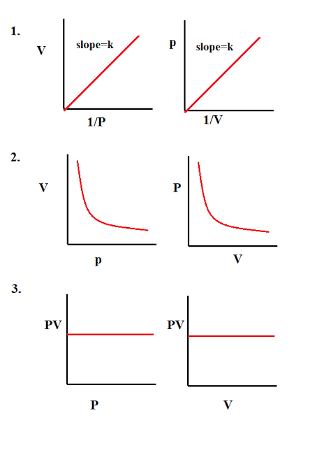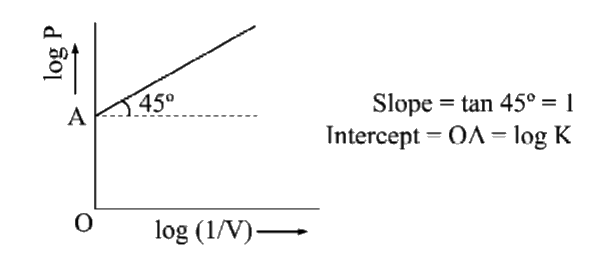

$P \propto \frac{1}{V}$

$PV\  = \ K$

$P = K \cdot \frac{1}{V}$

আবার, $P = K \cdot \frac{1}{V}$

$\log P = \log{\left( K \cdot \frac{1}{V} \right)\ }$

$\log P = \log\left( \frac{1}{V} \right) + \log K$

$$y\  = \ mx\  + \ c$$

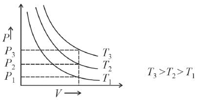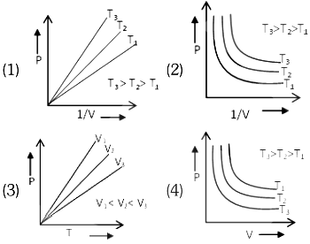

##### Q: মুখ দিয়ে বেলুন ফুলানোর ঘটনায় বয়েলের সূত্র প্রয়োগ করা যায় না কেন?

![[assets/media/image5-1.png]]

কম আয়তন, কম চাপ বেশি আয়তন, বেশি চাপ

উত্তরঃ

- "ভর নির্দিষ্ট না থাকায় বয়েলের সূত্র খাটেনা"

- "আর বেলুনের গ্যাস আদর্শ নয়"

### চার্লসের সূত্র

"স্থির চাপে কোনো নির্দিষ্ট ভরের গ্যাসের আয়তন, প্রতি ডিগ্রি সেলসিয়াস তাপমাত্রা বৃদ্ধিতে বা হ্রাসে 0°C তাপমাত্রার উক্ত গ্যাসের আয়তনের $\frac{1}{273}$ অংশ বৃদ্ধি বা হ্রাস পায়।"

$1^{\circ}C$ তাপমাত্রা বাড়ালে আয়তন বৃদ্ধি = $V_{0}$ এর $\frac{1}{273}$ অংশস

$\therefore$ $\theta^{\circ}C$ তাপমাত্রা বাড়ালে আয়তন বৃদ্ধি $= \frac{V_{0}\theta}{273}$

$\gamma_{p} = \frac{1}{273}\text{/}{^\circ}C$

$\gamma_{p}\  \rightarrow$ স্থির চাপে গ্যাসের আয়তন প্রসারণ সহগ

$V_{\theta} = V_{0} + \frac{V_{0}\theta}{273}$

$V_{\theta} = V_{0}\left( 1 + \frac{\theta}{273} \right)$

$V_{\theta} = V_{0}\left( 1 + \gamma_{p}\theta \right)$

$$\Rightarrow {\ \ \ \ V}_{\theta} = V_{0} + V_{0}\gamma_{p}\theta$$
$$V_{\theta} - V_{0} = V_{0}\gamma_{p}\theta$$

স্থির চাপে কোনো গ্যাসের তাপমাত্রা প্রতি ডিগ্রি সেলসিয়াস বৃদ্ধিতে ঐ গ্যাসের একক আয়তনে ঐ গ্যাসের আয়তনের পরিবর্তনকে স্থির চাপে আয়তন প্রসারণ সহগ বলে

$\Delta\theta = \theta - 0^{\circ}C = \theta$

$V_{0} = 1m^{3} , \quad \Delta\theta = 1^{\circ}C$

$\therefore\gamma_{p} = \Delta V$

$\gamma_{p} = \frac{\Delta V}{V_{0}\theta}$

$\therefore\gamma_{p} = \frac{\Delta V}{V_{0}\Delta\theta}$

$$T = \theta + 273$$

$V_{\theta} = V_{0}\left( 1 + \frac{\theta}{273} \right)$

$\Rightarrow V_{\theta} = V_{0}\frac{273 + \theta}{273}$

${\Rightarrow V}_{\theta} = \frac{V_{0}}{273}T$

$$\Rightarrow V_{0} = KT$$

$\therefore V \propto T$

#### পরম শূন্য তাপমাত্রা

"যে তাপমাত্রায় আদর্শ গ্যাসের আয়তন তাত্ত্বিকভাবে শূন্য হয়"

Impossible এই তাপমাত্রায় যাওয়া কারন গ্যাসের আয়তন বাস্তবে শূন্য বা ঋণাত্মক হতে পারে না।

$$\}$$

$V_{\theta} = V_{0}\left( 1 + \frac{\theta}{273} \right)$

$\therefore V_{- 272} = V_{0}\left( 1 + \frac{- 272}{273} \right) = ( + ve)$

$V_{+ 274} = V_{0}\left( 1 + \frac{- 274}{273} \right) = ( - ve)$

$V_{- 273} = V_{0}\left( 1 + \frac{- 273}{273} \right) = 0$

$\therefore\theta = - 273^{\circ}C = 0K$ \[পরমশূন্য তাপমাত্রা\]

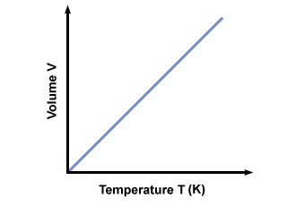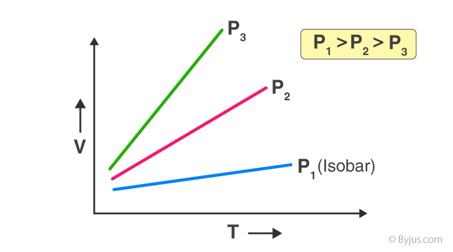

### চাপীয় সূত্র

গ্রাফ উপরের মতই

শুধু V এর পরিবর্তে

P হবে।

$P_{\theta} = P^{0}\left( 1 + \frac{\theta}{273} \right)$

$P_{\theta} = P^{0}\left( \frac{273 + \theta}{273} \right)$

$\therefore P_{\theta} = \frac{P^{0}}{273}T$

$$P\  \propto \ T\ $$

### অ্যাভোগেড্রোর Hypothesis

"স্থির তাপমাত্রা ও চাপে সম আয়তন মৌলিক বা যৌগিক যেকোনো গ্যাসে একই সংখ্যক অণু থাকে।"

অণুসংখ্যা same হলে মোলসংখ্যা ও same হবে।

$$\therefore V\  \propto \ n$$

"প্রমাণ তাপমাত্রা ও চাপে (STP তে) 1 mol সকল গ্যাসের আয়তন 22.4 L বা 22.4 dm³ "

স্মমিলিত সূত্র, $\frac{P_{1}V_{1}}{T_{1}} = \frac{P_{2}V_{2}}{T_{2}}$

সম্মিলিত সূত্র

$P_{1}V_{1} = P_{2}V_{2}$ $\rightarrow$ বয়েলের সূত্র

$\frac{V_{1}}{T_{1}} = \frac{V_{2}}{T_{2}}$ $\rightarrow$ চার্লসের সূত্র

$\frac{P_{1}}{T_{1}} = \frac{P_{2}}{T_{2}}$ $\rightarrow$ চাপীয় সূত্র

$R$ হলো মোলার গ্যাস ধ্রুবক

একমোল গ্যাসের জন্য $\frac{PV}{T} = R\ \ \ \ \ \ \ \  \Rightarrow PV = RT$

$\therefore$ n মোল গ্যাসের জন্য, $PV\, = \, nRT$

কারণ $\rho = \frac{m}{V}$

$\therefore\rho \propto \frac{1}{V}$

ঘনত্ব থাকলে, $\frac{P_{1}}{\rho_{1}T_{1}} = \frac{P_{2}}{\rho_{2}T_{2}}$

$$\frac{P_{1}V_{1}M_{1}}{m_{1}T_{1}} = \frac{P_{2}V_{2}M_{2}}{m_{2}T_{2}}$$ 
$\ \ \ \ \ \ \ \ \ \ n = \frac{m}{M}$

ভর ভিন্ন হলে, $\frac{P_{1}V_{1}}{m_{1}T_{1}} = \frac{P_{2}V_{2}}{m_{2}T_{2}}$

আনবিক ভর ভিন্ন হলে, $\frac{P_{1}V_{1}M_{1}}{T_{1}} = \frac{P_{2}V_{2}M_{2}}{T_{2}}$

মোল ভিন্ন থাকলে,

$PV\  = \ nRT$

$\Rightarrow R = \frac{PV}{nT}$

$\therefore\frac{P_{1}V_{1}}{n_{1}T_{1}} = \frac{P_{2}V_{2}}{n_{2}T_{2}}$

এটা দিয়েই সব করা যায়

##### Q: স্থির চাপে 3x10⁻⁴ m³ বায়ুকে 0°C হতে 50°C বৃদ্ধি করলে আয়তন 3.54x10⁻⁴ m³ হয়। আয়তন প্রসারণ গুণাঙ্ক কত?

$$\Rightarrow V = V^{0}\left( 1 + \delta_{p}\theta \right)$$
$$\Rightarrow 3.54 \times 10^{- 4} = 3 \times 10^{- 4}\left( 1 + \delta_{p} \times 50 \right)$$
$$\therefore\delta_{p} = 0.0036\text{/}{^\circ}C$$

## গড়বেগ, গড় বর্গবেগ, মূল গড় বর্গবেগ ও সমভাব্য বেগ

T বৃদ্ধিতে গ্যাসের অণুগুলোর বেগ বৃদ্ধি পায়।

$$\therefore E_{k} \propto T$$

গড়বেগ, $\overline{C} = \frac{\left( C_{1} + C_{2} + C_{3} - - - C_{N} \right)}{N}$

গড় বর্গবেগ, $\overline{C^{2}} = \frac{\left( C_{1}^{2} + C_{2}^{2} + C_{3}^{2} - - - C_{N}^{2} \right)}{N}$

মূল গড় বর্গবেগ, $C_{rms} = \sqrt{\overline{C^{2}}} = \sqrt{\frac{\left( C_{1}^{2} + C_{2}^{2} + C_{3}^{2} + - - - C_{N}^{2} \right)}{N}}$

##### Q: কেন বেগের গড় মান ব্যবহার না করে মূল গড় বর্গবেগ ব্যবহার করা হয় ?

$$\overset{\ \ \ \ \ \ \ \ 3\ {ms}^{- 1\ \ \ \ \ \ \ \ \ \ \ }}{\rightarrow}\ \ $$

$$\overset{\ \ \ \ \ \ \ \ \ \ \ 3\ {ms}^{- 1\ \ \ \ \ \ \ \ \ \ \ }}{\leftarrow}$$

এখন গড় বেগ বের করলে, $\overline{C} = \frac{\left( \overrightarrow{v} + \overrightarrow{v} \right)}{2}$

$= \frac{(3 - 3)}{2}$

$$\ \ \ \ \  = \ 0$$

কিন্তু বেগ যেদিকেই থাকুক না কেন সবদিকেই গতিশক্তি তৈরী হয়। আর, গতিশক্তি স্কেলার রাশি। ফলে এখানে গড় বেগ ব্যবহার করলে গতিশক্তি শূন্য আসে যা সত্য নয়।

কিন্তু,

$$\overline{C^{2}} = \frac{\left( ( + 3)^{2} + ( - 3)^{2} \right)}{2}= \frac{(9 + 9)}{2}= \ 9$$
$$\therefore C_{rms} = \sqrt{\overline{C^{2}}} = \sqrt{9} = 3$$

তাই $C_{rms}$ ব্যবহার করা হয়।

## গ্যাসে আণবিক গতিতত্ত্ব

$$\overrightarrow{c_{1}} = u_{1}\widehat{i} + v_{1}\widehat{j} + w_{1}\widehat{k} - - - ①$$
$$c_{1}^{2} = u_{1}^{2} + v_{1}^{2} + w_{1}^{2}$$
$$c_{2}^{2} = u_{2}^{2} + v_{2}^{2} + w_{2}^{2}$$
$$\vdots$$
$$c_{N}^{2} = u_{N}^{2} + v_{N}^{2} + w_{N}^{2}$$

মোট অণুর সংখ্যা $= \ N$

ঘনকের প্রতি বাহুর দৈর্ঘ্য $= \ l$

পাত্রের/গ্যাসের আয়তন, $V = l^{3}$

- প্রতিটি অণুর ভর $= \ m$

∴ মোট গ্যাসের ভর $M\  = \ mN$

এখন ধরি,

m ভরের অণু টি $u_{1}$ বেগে $x -$ অক্ষ বরাবর গতিশীল

সংঘর্ষের পর বেগের মান একই থাকে

(কারণ স্থিতিস্থাপক সংঘর্ষ)

∴ ভরবেগের পরিবর্তন $= - mu_{1} - mu_{1}$

$= \left| \  - 2mu_{1}\  \right|$

$= 2mu_{1}$

$l = t \cdot u_{1}$ $\therefore t = \frac{l}{u_{1}}$

$t\  =$ দুইটি ধাক্কার মধ্যবর্তী সময়

∴ ভরবেগের পরিবর্তনের হার $= \frac{2mu_{1}}{t} = \frac{2mu_{1}}{\frac{l}{u_{1}}}$ $= \frac{2mu_{1}^{2}}{l}$

∴ $X$ অক্ষ বরাবর ভরবেগের পরিবর্তনের হার $= \frac{2mu_{1}^{2}}{l}$

∴ $Y$ অক্ষ বরাবর ভরবেগের পরিবর্তনের হার $= \frac{2mv_{1}^{2}}{l}$

∴ $Z$ অক্ষ বরাবর ভরবেগের পরিবর্তনের হার $= \frac{2mw_{1}^{2}}{l}$

∴ ঐ অণুর মোট ভরবেগের পরিবর্তনের হার

$V = \frac{2mu_{1}^{2}}{l} + \frac{2mv_{1}^{2}}{l} + \frac{2mw_{1}^{2}}{l}$

$= \frac{2m}{l}\left( u_{1}^{2} + v_{1}^{2} + w_{1}^{2} \right)$

$= \frac{2m}{l}c_{1}^{2}$ \[∵ ① হতে\]

$C_{rms} = \sqrt{\overline{c^{2}}}$ $\ \ \ \ \ \ \ \ \ \ \ \ \ \therefore C_{rms}^{2} = \overline{c^{2}}$

নিউটনের সূত্র অনুযায়ী

ভরবেগের পরিবর্তনের হার = প্রযুক্ত বল

∴ মোট গ্যাসের সমস্ত অণুর ভরবেগের পরিবর্তনের হার

$= \frac{2m}{l}c_{1}^{2} + \frac{2m}{l}c_{2}^{2} + \frac{2m}{l}c_{3}^{2} + \ldots - \frac{2m}{l}c_{N}^{2}$

$= \frac{2m}{l}\left( c_{1}^{2} + c_{2}^{2} + c_{3}^{2} + \ldots - c_{N}^{2} \right)$

$= \frac{2m}{l} \times N\left( \frac{c_{1}^{2} + c_{2}^{2} + c_{3}^{2} + \ldots - c_{N}^{2}}{N} \right)$

$= \frac{2mN}{l} \times \overline{C^{2}}$

$= \frac{2mN}{l} \times C_{rms}^{2}$

= প্রযুক্ত বল \[নিউটনের সূত্র থেকে\]

সুবিধার জন্য $C_{rms}^{2}$ কে $C^{2}$ লেখা হলো

ঘনকের তলের ক্ষেত্রফল $= l^{2}$

ঘনকের আয়তন $V = l^{3}$

∴ চাপ $P = \frac{F}{A}\, = \frac{2mNC_{rms}^{2}}{l \times 6l^{2}} = \frac{1}{3}\frac{mNC_{rms}^{2}}{l^{3}}\, = \frac{1}{3}\frac{mNC_{rms}^{2}}{V}$

$$\therefore PV = \frac{1}{3}mNC^{2}$$

$\Rightarrow PV = \frac{1}{3}MC^{2}$ $\lbrack M = mN\rbrack$

$\therefore P = \frac{1}{3}\frac{M}{V}c^{2} = \frac{1}{3}\rho c^{2}$ → Main সূত্র

### গতিশক্তি

$PV = \frac{1}{3}MC^{2}$

$\Rightarrow PV = \frac{2}{3}\left( \frac{1}{2}Mc^{2} \right)$ $\left\lbrack E_{k} = \frac{1}{2}Mc^{2} \right\rbrack$

$\Rightarrow PV = \frac{2}{3}E$

$\Rightarrow E = \frac{3}{2}PV$

$\Rightarrow E = \frac{3}{2}nRT$ → n মোল গ্যাসের জন্য $\lbrack PV = nRT\rbrack$

$K = \frac{R}{N_{A}}$

$= 1.38 \times 10^{- 23}J.mol^{- 1}.k^{- 1}$

∴ এক মোল গ্যাসের গতিশক্তি, $E = \frac{3}{2}RT$

∴ একটি অনুর গতিশক্তি, $E = \frac{3}{2}\frac{R}{N_{A}}T\,$

∴ $E = \frac{3}{2}KT\,$

### মূল গড় বর্গবেগ

মূল গড় বর্গবেগ,

$C_{rms} = \sqrt{\frac{3RT}{M}} = \sqrt{\frac{3kT}{m}}$

গড়বেগ,

$C_{avg} = \sqrt{\frac{8RT}{\pi M}} = \sqrt{\frac{3kT}{\pi m}}$

সম্ভাব্য বেগ,

$C_{mp} = \sqrt{\frac{2RT}{M}} = \sqrt{\frac{2kT}{m}}$

এক মোল গ্যাসের জন্য $M$ হলো আণবিক ভর

$PV = \frac{1}{3}Mc^{2}$ → $C_{rms} = \sqrt{\frac{3PV\,}{M}} = \sqrt{\frac{3RT\,}{M}}$

$\Rightarrow P = \frac{1}{3}\rho c^{2}$ → $C_{rms} = \sqrt{\frac{3P\ }{\rho}}$

বর্গমূল গড় বর্গবেগ $C_{rms} = \sqrt{\frac{3PV\,}{M}} = \sqrt{\frac{3RT\,}{M}} = \sqrt{\frac{3P}{\rho}}$

একটি অনু/পরমানুর ভর m দেয়া থাকলে $C_{rms} = \sqrt{\frac{3KT\,}{m}}$

∴ $C_{rms} \propto \sqrt{T}$

##### MCQ: কোনো গ্যাসের ওপর প্রযুক্ত চাপ ২ গুন করা হলে গ্যাসে গতিশক্তি কত গুন হবে।

$$(i)\ 2\ \ \ \ \ \ (ii)\ \sqrt{2}\ \ \ \ \ \ (iii)\ ½\ \ \ \ \ \ (iv)\ ¼\ \ \ \ \ \ (v)\ None$$

উত্তরঃ $E = \frac{3}{2}PV$ $\therefore\ E\  \propto \ P$ ∴ P দ্বিগুন হলে E দ্বিগুন হওয়ার কথা

→ তবে আদর্শ গ্যাসে তাপমাত্রা স্থির থাকলে $PV = \ ধ্রুব$

∴ যদি $P' = 2P$ হয়, তাহলে $V = ½\ V$ হবে কারণ $V \propto \frac{1}{P}$

∴ তখন $E' = \frac{3}{2} \times 2P \times \frac{1}{2}V = \frac{3}{2}PV = E$

∴ চাপ দ্বিগুণ করলে আয়তন অর্ধেক হওয়ায় গতিশক্তি অপরিবর্তিত থাকবে।

একমাত্র T পরিবর্তনে গতিশক্তি পরিবর্তিত হবে

\... E is only function of T. যদি মোলসংখ্যা একই থাকে

Note: তবে গ্যাস সিলিন্ডারের কথা বললে বা যেখানে আয়তন স্থির, সেখানে চাপের প্রভাব থাকবে।

##### MCQ: কোনো গ্যাসের চাপ 4 গুন করলে $\mathbf{C}_{\mathbf{rms}}$ কত গুন হবে

$$(i)\ 2\ \ \ \ (ii)\ \sqrt{2\ }\ \ \ \ (iii)\ ½\ \ \ \ (iv)4\ \ \ \ (v)\ None$$

উত্তরঃ $C_{rms} = \sqrt{\frac{3PV}{M}}C_{rms} = \sqrt{\frac{3P}{\rho}}$

আদর্শ গ্যাসে PV = ধ্রুব ∴ $P' = 4P\ হলে\ \ \ V' = V\text{/}4$

$\therefore C_{rms}' = \sqrt{\frac{3 \times 4P \times \frac{1}{4}V}{M}} = \sqrt{\frac{3PV}{M}} = C_{rms}$

$C_{rms}$ একমাত্র T পরিবর্তনে পরিবর্তন হয় (ভর ভিন্ন হলেও)

তবে গ্যাস একই হতে হবে

##### Q: একই তাপমাত্রার সকল গ্যাসের অণুর গতিশক্তি সমান। প্রমান কর।

| O₂ গ্যাসের জন্য                                             | H₂ গ্যাসের জন্য                                            |
| :---------------------------------------------------------- | :--------------------------------------------------------- |
| $E_{1} = \frac{1}{2}m_{1}c_{1}^{2}$                         | $E_{2} = \frac{1}{2}m_{2}c_{2}^{2}$                        |
| $c_{1} = \sqrt{\frac{3kT}{m_{1}}}$                          | $c_{2} = \sqrt{\frac{3kT}{m_{2}}}$                         |
| $\therefore T = \frac{m_{1}c_{1}^{2}}{3k}\ \quad - - - (i)$ | $\therefore T = \frac{m_{2}c_{2}^{2}}{3k}\quad - - - (ii)$ |

\(i\) ও (ii) থেকে,

$\frac{m_{1}c_{1}^{2}}{3k} = \frac{m_{2}c_{2}^{2}}{3k}$

$\Rightarrow \frac{1}{2}m_{1}c_{1}^{2} = \frac{1}{2}m_{2}c_{2}^{2}$

$\therefore E_{1} = E_{2}\quad\text{(Proved)}$

যেহেতু গ্যাসের বেগ যত বেশি সে ততো তাড়াতাড়ি ছড়িয়ে যেতে পারে, তাই গ্যাসের অনুর বেগ ছড়ানোর হারের সমানুপাতিক $C \propto r$

$\therefore\ \frac{c_{1}}{c_{2}} = \frac{r_{1}}{r_{2}}$

গ্রাহামের ব্যাপন সূত্রঃ

$C_{\pi ms} = C = \sqrt{\frac{3\rho}{\rho}}$

$\therefore C \propto \frac{1}{\sqrt{\rho}}$ \[চাপ ধ্রুব\]

$\frac{c_{1}}{c_{2}} = \sqrt{\frac{\rho_{2}}{\rho_{1}}}$ $\therefore\sqrt{\frac{r_{1}}{r_{2}}} = \sqrt{\frac{\rho_{2}}{\rho_{1}}}$

## ডাল্টনের আংশিক চাপঃ

$P = P_{1} + P_{2} + P_{3}$

গ্যাসগুলো সম আয়তনে মিশ্রিত থাকতে হবে

$$= \frac{1}{3}\frac{m_{1}}{V}{C_{1}}^{2} + \frac{1}{3}\frac{m_{2}}{V}{C_{2}}^{2} + \frac{1}{3}\frac{m_{3}}{V}{C_{3}}^{2}$$

$P = \frac{1}{3}\rho_{1}{C_{1}}^{2} + \frac{1}{3}\rho_{2}{C_{2}}^{2} + \frac{11}{3}\rho_{3}{C_{3}}^{2}$

মোল সংখ্যা , $n = \frac{m}{M} = \frac{N}{N_{A}} = \frac{V}{22.4} = S \times V$

$m\, \rightarrow$ একটি অনুর ভর (kg)

##### Q: $\mathbf{K}\mathbf{=}\mathbf{1.638}\mathbf{\times}\mathbf{10}^{\mathbf{- 23}}\mathbf{J}\mathbf{k}^{\mathbf{- 1}}$ $\mathbf{O}^{\mathbf{\circ}}\mathbf{C}$ উষ্ণতার কোনো গ্যাসের অণুর ভর 2g হলে তার $\mathbf{C}_{\mathbf{rms}}$ বেগ কত?

$\Rightarrow C_{rms} = \sqrt{\frac{3KT}{m}} = \sqrt{\frac{3 \times 138 \times 10^{- 23} \times 2 \times 3}{2 \times 10^{- 3}}}$

$= 2.37 \times 10^{- 0}ms^{- 1}$

##### Q: $\mathbf{O}^{\mathbf{\circ}}\mathbf{C}$ তাপমাত্রায় $\mathbf{N}_{\mathbf{2}}$ গ্যাসের $\mathbf{C}_{\mathbf{rms}}\mathbf{= 493}\mathbf{m}{\overline{\mathbf{s}}}^{\mathbf{-}\mathbf{1}}$ হলে স্বাভাবিকে চাপ ও তাপমাত্রার $\mathbf{N}_{\mathbf{2}}$ এর ঘনত্ব বের কর। স্বাভাবিক চাপ ও তাপমাত্রায় পারদের ঘনত্ব $\mathbf{13.59}\mathbf{\times}\mathbf{1}\mathbf{0}^{\mathbf{3}}\mathbf{m}^{\mathbf{-}\mathbf{3}}$ ও $\mathbf{g}\mathbf{= 9.81}\mathbf{m}\mathbf{s}^{\mathbf{-}\mathbf{2}}$

চাপ পরিবর্তনে যেহেতু $C_{rms}$ পরিবর্তিত হয় না তাই $C_{rms}$ এর আগের মান ব্যবহৃত হয়েছে

চাপ পরিবর্তনে যেহেতু আয়তন পরিবর্তিত হয় তাই ঘনত্ব পরিবর্তিত হবে।

এখানে চাপ, $P = h \times \rho_{Hg} \times g$

$\ \ \ \ \ \ \ \ \ \ \ \ \ \ \ \ \ \ \ \ \ \  = .76 \times 13.59 \times 10^{3} \times 9.81$

$C_{rms} = \sqrt{\frac{3P}{\rho}}$

$\Rightarrow \rho = \frac{3 \times .76 \times 13.59 \times 10^{3} \times 9.81}{(493)^{2}}$

$= 1.25\ Kg\ m^{- 3}$

##### Q: $\mathbf{2}\mathbf{\times}\mathbf{1}\mathbf{0}^{\mathbf{5}}\mathbf{p}_{\mathbf{a}}$ চাপ ও $\mathbf{2}\mathbf{7}^{\mathbf{\circ}}\mathbf{C}$ তাপমাত্রা $\mathbf{N}_{\mathbf{2}}$ এর ঘনত্ব কত?

$\frac{P_{1}}{\rho_{1}T_{1}} = \frac{P_{2}}{\rho_{2}T_{2}} \Rightarrow \rho_{2} = \frac{P_{2}\rho_{1}T_{1}}{P_{1}T_{2}} = \frac{2 \times 10^{5} \times 1.25 \times 273}{.76 \times 13.59 \times 103 \times 9.81 \times 300} = 2.24$ $kg\text{/}m^{3}$

অ্যাডমিশনে সকল ক্ষেত্রে $\frac{3}{2}$ ব্যবহার করা যাবে না, $\frac{f}{2}$ ব্যবহার করতে হবে

\[চিত্র: দুইটি পাত্রের গ্যাসের মিশ্রণ দেখানো হচ্ছে\]

##### Q: 57$\mathbf{\ }^{\mathbf{\circ}}$C তাপমাত্রার এক মোল $\mathbf{H}_{\mathbf{2}}$ গ্যাস ও $\mathbf{2}\mathbf{7}^{\mathbf{\circ}}$C তাপমাত্রার একমোল আর্গনের সাথে মেশানো হলে মিশ্রণের তাপমাত্রা কত?

$E = E_{1} + E_{2}$

$\Rightarrow \frac{3}{2}nRT = \frac{3}{2}n_{1}RT_{1} + \frac{3}{2}n_{2}RT_{2}$

$\Rightarrow nRT = n_{1}RT_{1} + n_{2}RT_{2}$

$\Rightarrow T = \frac{n_{1}T_{1} + n_{2}T_{2}}{n}$

$\Rightarrow T = \frac{1(57 + 273) + 1(27 + 273)}{2}$

$\Rightarrow T = 315\ K$

$\Rightarrow T = 42^{\circ}C$

এখানে মোল সংখ্যা একই তাই কাকতালীয় ভাবে দুই পাত্রের তাপমাত্রার গড় চলে আসছে। তবে মোল সংখ্যা ভিন্ন হলে তা হতো না।

##### Q: কোনো একটি ঘরের তাপমাত্রা $\mathbf{0}^{\mathbf{\circ}}$C এবং ঐ ঘরে 250 mole গ্যাস আছে। অন্তরক পদার্থে তৈরী একটি সিলিন্ডারে $\mathbf{60}^{\mathbf{\circ}}$C এ 5 mol হিলিয়াম গ্যাস আছে। পাত্রটি খুলে দিলে ঘরের তাপমাত্রা কত হবে?

আদর্শ গ্যাসের মোট শক্তিই গতিশক্তি*,* বিভবশক্তি নেই।এখানে গ্যাসগুলোকে আদর্শ ধরেই হিসাব করা হয়।

ধরি, চূড়ান্ত তাপমাত্রা T

শক্তি সংরক্ষণশীলতার নীতি অনুযায়ী,

মেশার পূর্বে মোট শক্তি = মেশার পরের মোট শক্তি

$E_{1} + E_{2} = E_{1}' + E_{2}'$

$\Rightarrow \frac{5}{2}n_{1}RT_{1} + \frac{3}{2}n_{2}RT_{2} = \frac{5}{2}n_{1}RT + \frac{3}{2}n_{2}RT$

$\Rightarrow \frac{5}{2}n_{1}T_{1} + \frac{3}{2}n_{2}T_{2} = T\left( \frac{5}{2}n_{1} + \frac{3}{2}n_{2} \right)$

$T = \frac{\frac{5}{2} \times 250 \times 273 + \frac{3}{2} \times 5 \times 333}{\frac{5}{2} \times 250 + \frac{3}{2} \times 5}$

$\therefore T = 273.71K = 0.71^{\circ}C$

General formula $T = \frac{n_{1}T_{1} + n_{2}T_{2}}{n_{1} + n_{2}}$

$\ \ \ \ \ \ \ \ \ \ \ \ \ \ \ \ \ \ \ \  \Rightarrow T = \frac{f_{1}n_{1}T_{1} + f_{2}n_{2}T_{2}}{f_{1}n_{1} + f_{2}n_{2}}$

##### $\mathbf{Q:\ \ \ }\mathbf{0}^{\mathbf{\circ}}\mathbf{C}$ তাপমাত্রার এবং $\mathbf{1.0}\mathbf{\times}\mathbf{1}\mathbf{0}^{\mathbf{5}}\mathbf{Pa}$ চাপে $\mathbf{C}\mathbf{O}_{\mathbf{2}}$ গ্যাসের ঘনত্ব $\mathbf{1.98\ }\mathbf{kg}\textbf{/}\mathbf{m}^{\mathbf{3}}$ হলে $\mathbf{3}\mathbf{0}^{\mathbf{\circ}}\mathbf{C}$ তাপমাত্রায় একই চাপে উক্ত গ্যাসের $\mathbf{C}_{\mathbf{rms}}$ বেগ কত?

Note: এখানে যেহেতু এক্সট্রা ডাটা ঘনত্ব দেয়া আছে তাই এটাকে কাজে লাগাতে হবে। ডাইরেক্ট $\sqrt{\frac{3RT}{m}}$ দিলে উত্তর মিলবে না।

$C_{rms} = \sqrt{\frac{3P}{\rho}}$

$C_{o} = \sqrt{\frac{3 \times 1 \times 10^{5}}{1.98}} = 389.25m\text{/}s$

আবার, $C_{rms} \propto \sqrt{T}$

$\therefore\frac{C_{o}}{C_{30}} = \sqrt{\frac{T_{o}}{T_{30}}}$

$\Rightarrow C_{30} = C_{o} \times \sqrt{\frac{T_{30}}{T_{o}}}$

$= 389.25 \times \sqrt{\frac{273 + 30}{273}}$

$\therefore C_{30} = 410.8\ m{\overline{s}}^{- 1}$

##### Q: স্থির চাপে কত তাপমাত্রার কোনো গ্যাসের অণুর মূলগড় বর্গবেগ প্রমাণ চাপ ও তাপমাত্রার মূল গড় বেগের দ্বিগুণ হবে।

$C = \sqrt{\frac{3RT}{m}}$ , এখন, $C_{rms} \propto \sqrt{T}$

$\therefore\frac{C_{1}}{C_{2}} = \sqrt{\frac{T_{1}}{T_{2}}}$ $\Rightarrow$ $\frac{C}{2C} = \sqrt{\frac{273}{T_{2}}}$ $\Rightarrow$ $T_{2} = 1092K$

## গড় মুক্ত পথঃ

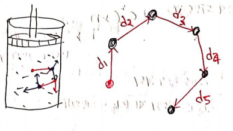

"গ্যাসের অণুগুলোর মধ্যে সংঘটিত দুইটি সংঘর্ষের মধ্যবর্তী সময়ে অণু মুক্ত ভাবে যে পথ অতিক্রম করে তাকে বলা হয় মুক্ত পথ। এরূপ মুক্তপথের গড় মানকে গড় মুক্তপথ বলে"
$$\lambda = \frac{d_{1} + d_{2} + d_{3} + d_{4} + d_{5}}{5}$$
$$\lambda = \frac{\style{font-family: 'BCC Purno';}{\text{মুক্ত পথ}}}{\style{font-family: 'BCC Purno';}{\text{ধাক্কার সংখ্যা / অনুসংখ্যা}}}$$
### ক্লসিয়াসের মুক্ত পথের রাশিমালা

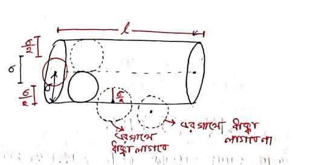

ধরি,

$\sigma^{\ } =$ অনুর ব্যাস

$n =$ একক আয়তনে অনুর সংখ্যা

বদ্ধ সিস্টেমে একটি ক্ষুদ্র সিলিন্ডারের কথা চিন্তা করি যার ব্যাসার্ধ $\sigma^{\ }$। যে সকল অনুর কেন্দ্র সিলিন্ডারের মধ্যে থাকবে কেবল তাদের সাথেই ধাক্কা লাগবে।

যেহেতু লাল অনুটি সিলিন্ডারের এক মাথা থেকে ধাক্কা খেতে খেতে অন্য প্রান্তে যাবে মোট মুক্তপথ হবে $l$।

এখানে সিলিন্ডারের আয়তন = $\pi\sigma^{2}l$।

মোট অণুর সংখ্যা = (একক আয়তনে অনুর সংখ্যা) $\times$ (সিলিন্ডারের আয়তন) = $n \times \pi\sigma^{2}l$।

গড়মুক্ত পথ, $\lambda = \frac{মোটমুক্তপথ}{ধাক্কারসংখ্যাবাঅনুরসংখ্যা}$

$\Rightarrow \lambda = \frac{l}{\pi\sigma^{2}\ln}$

$\lambda_{c} = \frac{1}{\pi\sigma^{2}n}$

এটাই ক্লসিয়াসের মতে অনুর গড় মুক্তপথ।

বোল্টজম্যানের মতে, $\lambda_{b} = \frac{3}{4\pi\sigma^{2}n}$

ম্যাক্সওয়েল এর মতে, $\lambda_{m} = \frac{1}{\sqrt{2}\pi\sigma^{2}n}$

এদের তুলনা: $\lambda_{c} > \lambda_{b} > \lambda_{m}$

$1 > \ \frac{3}{4}\ \  > \frac{1}{\sqrt{2}}$

**বিশেষ দ্রষ্টব্য:** প্রশ্নে কিছু উল্লেখ না করলে ম্যাক্সওয়েল এর সূত্র ($\lambda_{m} = \frac{1}{\sqrt{2}\pi\sigma^{2}n}$) ব্যবহার করবো

**Note:** বোর্ড বইয়ে গড় বেগ নিয়ে বিস্তারিত আলোচনা না থাকায় সেখানে $C_{rms}$ বেগ ব্যবহৃত হয়েছে। যদিও real calculation এ এটা গড় বেগ হওয়ার কথা। তাই পরীক্ষায় $C_{rms}$ ব্যবহার করতে হবে।

প্রতি একক সময়ে ধাক্কার সংখ্যাঃ

$\lambda = \frac{মোটমুক্তপথ}{ধাক্কারসংখ্যা}$

$\Rightarrow ধাক্কারসংখ্যা = \frac{মোটমুক্তপথ}{\lambda}$

$\Rightarrow \frac{ধাক্কারসংখ্যা}{সময়} = \frac{মোটমুক্তপথ}{সময়} \times \frac{1}{\lambda}$

$$\Rightarrow এককসময়ে\ ধাক্কারসংখ্যা = গড়\ বেগ \times \frac{1}{\lambda}$$

$N = \frac{\overline{C}}{\lambda}$ $\Rightarrow N = \frac{C_{rms}}{\lambda}$

### গড় মুক্ত পথের সাথে তাপ, চাপ, ঘনত্বের সম্পর্ক

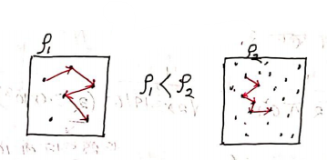

• **ঘনত্বের সাথে:** $\lambda \propto \frac{1}{\rho}$

\- ঘনত্ব বাড়লে $\lambda$ কমবে।

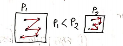

• **চাপের সম্পর্ক:** $\lambda \propto \frac{1}{P}$ (যখন তাপমাত্রা স্থির)

\- চাপ বাড়লে আয়তন কমে ও ঘনত্ব বাড়ে, তাই $\lambda$ কমে।

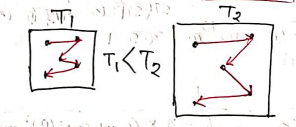

• **তাপমাত্রার সম্পর্ক:** $\lambda \propto T$ (যখন চাপ স্থির) \

\- সকল ক্ষেত্রেই ঘনত্ব ম্যাটার করে।

পরিস্থিতি অনুযায়ী বুঝতে হবে।

\- তাপ বাড়লে আয়তন বাড়ে ফলে ঘনত্ব কমে তাই $\lambda$ বাড়ে।

##### Q: কোনো গ্যাসের অনুর ব্যাসার্ধ $\mathbf{3.6}\mathbf{\times}\mathbf{1}\mathbf{0}^{\mathbf{-}\mathbf{8}}\mathbf{cm}$ এবং প্রতি ঘন সে.মি তে অণুর সংখ্যা $\mathbf{2.79}\mathbf{\times}\mathbf{1}\mathbf{0}^{\mathbf{19}}$ হলে অনুর গড় মুক্তপথ কত?

এখানে, ব্যাসার্ধ $r = 3.6 \times 10^{- 8}cm$,

তাহলে ব্যাস $\sigma = 2r = 2 \times 3.6 \times 10^{- 8}cm = 7.2 \times 10^{- 8}cm$

একক আয়তনে অনু সংখ্যা, $n = 2.79 \times 10^{19}cm^{- 3}$

$\lambda = \frac{1}{\sqrt{2}\pi\sigma^{2}n} = \frac{1}{\sqrt{2} \times 3.1416 \times (7.2 \times 10^{- 8})^{2} \times 2.79 \times 10^{19}}$

$= 1.556 \times 10^{- 5}cm$ $= 1.556 \times 10^{- 7}m$

##### Q: 3 atm চাপে এবং $\mathbf{2}\mathbf{8}^{\mathbf{\circ}}$C তাপমাত্রায় 16g $\mathbf{O}_{\mathbf{2}}$ গ্যাস আছে। অনুগুলোর ব্যাসার্ধ $\mathbf{1.5}\mathbf{\times}\mathbf{1}\mathbf{0}^{\mathbf{-}\mathbf{10}}\mathbf{m}$। 1. ম্যাক্সওয়েলের হিসাবে গড়মুক্তপথ? 2. ক্লসিয়াস ও বোল্টজম্যান প্রদত্ত নীতি অনুযায়ী একক সময়ে সংঘটিত ধাক্কার তারতম্য বের কর।

1.  এখানে, $P = 3atm = 3 \times 101325Pa$

> $T = (273 + 28)K = 301K$
>
> $\sigma = 2 \times 1.5 \times 10^{- 10}m = 3.0 \times 10^{- 10}m$

প্রথমে একক আয়তনে ($V = 1m^{3}$) অণুর সংখ্যা $n$ বের করতে হবে।

ধরি $n' =$ মোল সংখ্যা।

$PV = n'RT$ $\Rightarrow n' = \frac{PV}{RT} = \frac{3 \times 101325 \times 1}{8.316 \times 301} = 121.4386\ mol$

একক আয়তনে মোল সংখ্যা, $n' = 121.4386\ mol$

$\therefore$একক আয়তনে অনু সংখ্যা, $n = n' \times N_{A} = 121.4386 \times 6.023 \times 10^{23}$

$\therefore n = 7.31 \times 10^{25}m^{- 3}$

এখন, ম্যাক্সওয়েলের গড়মুক্তপথ,

$\lambda_{m} = \frac{1}{\sqrt{2}\pi\sigma^{2}n} = \frac{1}{\sqrt{2}\pi\left( 3.0 \times 10^{- 10} \right)^{2} \times 7.31 \times 10^{25}} =$ $3.42 \times 10^{- 8}m$

2.  এখানে, $C_{rms} = \sqrt{\frac{3RT}{M}} = \sqrt{\frac{3 \times 8.316 \times (273 + 28)}{32 \times 10^{- 3}}}$ (পারমানবিক ভর কেজিতে) $C_{rms} = 484.42\ m{\overline{s}}^{- 1}$ (প্রশ্নে 16g $O_{2}$ দেয়া থাকলেও সূত্রে একমোল গ্যাসের কেজিতে ভর বসাতে হবে)

একক সময়ে ধাক্কা, $N = \frac{C_{rms}}{\lambda}$

বোল্টজম্যাল ও ক্লসিয়াসের নীতি অনুসারে একক সময়ে ধাক্কার তারতম্য হবে,

$N_{c} - N_{b} = \frac{C_{rms}}{\lambda_{c}} - \frac{C_{rms}}{\lambda_{b}}$ $= \frac{C_{rms}}{\frac{1}{\pi\sigma^{2}n}} - \frac{C_{rms}}{\frac{3}{4\pi\sigma^{2}n}}$

$= C_{rms}\pi\sigma^{2}n\left( 1 - \frac{4}{3} \right)$ $= 484.42 \times \pi \times (3.0 \times 10^{- 10})^{2} \times 7.31 \times 10^{25} \times ( - \frac{1}{3})$ $\approx - 3.33 \times 10^{9}s^{- 1}$

## স্বাধীনতার মাত্রা (Degree of freedom (f))

কোনো গতিশীল সিস্টেমের অবস্থা (state) বা অবস্থান (Position) নির্দিষ্ট ভাবে প্রকাশ করার জন্য যত সংখ্যক স্বাধীন চলরাশির প্রয়োজন হয় তাকে ঐ গতীয় সিস্টেমের স্বাধীনতার মাত্রা বলে।

মাত্রা-

• রৈখিক গতির জন্য (X, Y, Z অক্ষ বরাবর):

\- বস্তুর গতি সরলরৈখিক: $f = 1$ \[চিত্র: একটি অণু এক অক্ষে গতিশীল\]

\- কোনো তলে: $f = 2$ \[চিত্র: একটি অণু তলে গতিশীল\]

\- শূন্যে থাকলে: $f = 3$ \[চিত্র: একটি অণু ত্রিমাত্রিক স্থানে গতিশীল\]

• আবর্তনের জন্য

• স্পন্দন / কম্পনের জন্য

উদাহরণঃ
একপরমানবিক গ্যাসঃ রোইখিক গতির জন্য f=3, ঘূর্নণের ফলে এর অবস্থানের পরিবর্তন হয় না।

দ্বিপারমানবিক গ্যাসঃ অনু তিন অক্ষ বরাবরই গতিশীল থাকে (f=3) আবার দুই অক্ষ বরাবর ঘুরতে পারে (f=2),মোট $f = 5$। যেহেতু অনুটি এর বন্ধন বরাবর ঘুরলে এর অবস্থানের পরিবর্তন হয় না। তাই বাকি দুই অক্ষের সাপেক্ষে এর ঘূর্ণন হিসাব করা হয়। কারণ তখন অবস্থান পরিবর্তিত হবার ফলে যেকোনো দুই অক্ষ বরাবর ঘূর্ণন কাজ করে।

বহু পারমানবিক গ্যাসঃ অনু তিন অক্ষ বরাবরই গতিশীল থাকে। এবং এদের ঘূর্ণন তিন অক্ষ বরাবরই হয়। অর্থাৎ একটি বহুপারমাণবিক কণা ঘুরতে থাকলে তিন অক্ষ বরাবরই অবস্থান পরিবর্তন হয়। $f = 6$ \[চিত্র: একটি বহুপারমানবিক অণু ঘূর্ণনরত\]

| গ্যাসের ধরন           | স্বাধীনতার মাত্রা (f)                            |
| :-------------------- | :----------------------------------------------- |
| এক পারমানবিক গ্যাসের  | $f = 3$                                          |
| দ্বিপারমাণবিক গ্যাসের | $f = 5$                                          |
| বহু পারমানবিক গ্যাসের | $f = 6$ $\left( কেবল\ CO_{2}\ এর\ f = 5 \right)$ |

General formula: $f = 3N - k$

(N = কতগুলো পরমাণু, k = কয়টা বন্ধন (দ্বিবন্ধন বা ত্রিবন্ধনকে একটি হিসেবে ধরবো))

তবে সবক্ষেত্রে এই ফর্মুলা কাজ করে বাধাতে পারে।

## শক্তির সমবিভাজন নীতিঃ

তাপীয় সাম্যাবস্থায় আছে এমন তাপগতীয় সিস্টেমের মোট শক্তি বিভিন্ন স্বাধীনতার মাত্রার ভেতর সমভাবে বণ্টিত হয় এবং প্রতি স্বাধীনতার মাথাপিছু শক্তির পরিমান হয় $\frac{1}{2}kT$।

যেমন: কোনো গ্যাসীয় অনুর $C_{rms}$ বেগ ধরা হয়। যেহেতু এটি একধরণের গড় বেগ, তাই বলা যায় এটি 3D স্থানাঙ্কের তিন অক্ষ বরাবর প্রায় সমান উপাংশ থাকবে।

অর্থাৎ, $C_{rms}^{2} = u^{2} + v^{2} + w^{2}$ এবং $u^{2} = v^{2} = w^{2} = \frac{1}{3}C_{rms}^{2}$।

$\therefore\frac{1}{2}mu^{2} = \frac{1}{2}mv^{2} = \frac{1}{2}mw^{2} = \frac{1}{3} \times \frac{1}{2}mC_{rms}^{2}$

যেহেতু মোট গতিশক্তি $E_{k} = \frac{1}{2}mC_{rms}^{2} = \frac{3}{2}kT$ (এক পারমানবিক গ্যাসের জন্য)

$\therefore\frac{1}{2}mu^{2} = \frac{1}{2}mv^{2} = \frac{1}{2}mw^{2} = \frac{1}{3} \times \frac{3}{2}kT = \frac{1}{2}kT$।

(যদিও Math এ সর্বদা $\frac{3}{2}kT$ Use হয়, বহু বা এক পারমানবিক যাই হোক)।
(তবে একটি অণুর মোট গতিশক্তি $E_{k} = \frac{f}{2}kT$)

আবার বহু পারমানবিকের ক্ষেত্রে, সকল মাত্রা বরাবর গতিশক্তি হলো: $\frac{1}{2}mu^{2} + \frac{1}{2}mv^{2} + \frac{1}{2}mw^{2} + \frac{1}{2}I_{x}\omega_{x}^{2} + \frac{1}{2}I_{y}\omega_{y}^{2} + \frac{1}{2}I_{z}\omega_{z}^{2} = \frac{f}{2}kT$ (রৈখিক গতিশক্তি + ঘূর্ণন গতিশক্তি)

এখানে $I$ ও $\omega$ এর মান বসালে দেখা যাবে প্রতিটি পদের মান $\frac{1}{2}kT$ হয়। $\frac{1}{2}mu^{2} = \frac{1}{2}mv^{2} = \frac{1}{2}mw^{2} = \frac{1}{2}I_{x}\omega_{x}^{2} = \frac{1}{2}I_{y}\omega_{y}^{2} = \frac{1}{2}I_{z}\omega_{z}^{2} = \frac{1}{2}kT$

মোট শক্তি $\frac{f}{2}kT$ মোট $f$ ভাগে সমান ভাগে বণ্টিত হবে। প্রতি স্বাধীনতার মাত্রার ভেতর $\frac{1}{2}kT$ পরিমান শক্তি থাকবে। স্বাধীনতার মাত্রা অনুযায়ী শক্তি সমানভাবে বণ্টিত হবে এবং প্রতি স্বাধীনতার মাত্রার জন্য $\frac{1}{2}kT$ পরিমান শক্তি থাকবে।

## সম্পৃক্ত ও অসম্পৃক্ত বাষ্প

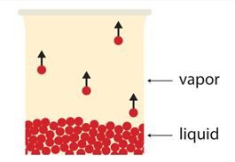

**সম্পৃক্ত বাষ্প:** কোনো নির্দিষ্ট তাপমাত্রার কোনো আবদ্ধ স্থানের বায়ুতে যে পরিমান বাষ্প থাকতে পারে, যদি ঐ পরিমান বাষ্পই উপস্থিত থাকে তাহলে ঐ বাষ্পকে সম্পৃক্ত বাষ্প বলে। এর দ্বারা সৃষ্ট চাপই সম্পৃক্ত বাষ্প চাপ।

**অসম্পৃক্ত বাষ্প:** ঐ পরিমান যদি না থাকে।

সম্পৃক্ত অবস্থায় পানি ও বায়ুর মধ্যে একধরণের সাম্যাবস্থা থাকে। অর্থাৎ পানি যে হারে বাষ্পে পরিণত হতে থাকে (বাষ্পীভবন), একই হারে আবার কিছু বাষ্প পানিতে পরিণত হতে থাকে (ঘনীভবন)।

**Note:** এখানে অতিপৃক্ত অবস্থার কোনো উল্লেখ নেই। এখানে অতিপৃক্তকে সম্পৃক্ত ধরা হয়, কারণ পানির ক্ষেত্রে অধঃক্ষেপ বা বায়ুর ক্ষেত্রে নিচে জমা পানি বাদে বাকি অংশটুকু সম্পৃক্ত অবস্থাতেই থাকে।

### সম্পৃক্ত বাষ্পচাপ ও অসম্পৃক্ত বাষ্পচাপের পার্থক্য

| বিষয়            | সম্পৃক্ত বাষ্পচাপ                                                                                                                                   | অসম্পৃক্ত বাষ্পচাপ                                                                                                                             |
| :-------------- | :-------------------------------------------------------------------------------------------------------------------------------------------------- | :--------------------------------------------------------------------------------------------------------------------------------------------- |
| **সংজ্ঞা**      | নির্দিষ্ট তাপমাত্রায় কোনো আবদ্ধ স্থানে সর্বাধিক যে পরিমাণ জলীয় বাষ্প থাকতে পারে, সেই অবস্থায় জলীয় বাষ্প যে চাপ দেয় তাকে সম্পৃক্ত বাষ্পচাপ বলে। | নির্দিষ্ট তাপমাত্রায় কোনো স্থানে বায়ুতে যদি তার ধারণ ক্ষমতার চেয়ে কম জলীয় বাষ্প থাকে, তখন ঐ বাষ্প যে চাপ দেয় তাকে অসম্পৃক্ত বাষ্পচাপ বলে। |
| **সৃষ্টি**      | শুধু আবদ্ধ স্থানে তৈরী হয়।                                                                                                                         | খোলা ও আবদ্ধ দুই স্থানেই হয়।                                                                                                                  |
| **সাম্যাবস্থা** | সম্পৃক্ত বাষ্প তরলের সাথে সাম্যাবস্থা তৈরী করে                                                                                                      | তরলের সাথে সাম্যাবস্থা তৈরী করে না                                                                                                             |
| **সূত্র**       | চার্লস ও বয়েলের সূত্র মানে না                                                                                                                      | চার্লস ও বয়েলের সূত্র মানে।                                                                                                                   |
| **অন্যান্য**    | চাপ বৃদ্ধিতে স্ফুটনাঙ্ক বেড়ে যায়, তাপমাত্রা হ্রাসে অসম্পৃক্ত বাষ্পকে সম্পৃক্ত করা যায়।                                                            | তাপমাত্রা বৃদ্ধিতে সম্পৃক্ত বাষ্পকে অসম্পৃক্ত করা যায়।                                                                                         |

##### Q: কেন সম্পৃক্ত বাষ্প চার্লস/বয়েলের সূত্র মানে না?

......................

## আর্দ্রতা

কোনো স্থানের আর্দ্রতা নির্ভর করে ঐ স্থানে উপস্থিত জলীয় বাষ্পের ওপর।

আর্দ্রতা দুইভাবে প্রকাশ করা যায়: ① পরম আর্দ্রতা ② আপেক্ষিক আর্দ্রতা

**পরম আর্দ্রতাঃ** কোনো অঞ্চলে প্রতি একক আয়তনে উপস্থিত জলীয় বাষ্পের ভরকে পরম আর্দ্রতা বলে। (একক $kg\text{/}m^{3}$) \

**আপেক্ষিক আর্দ্রতা:** কোনো সময়ে নির্দিষ্ট তাপমাত্রার বায়ুতে উপস্থিত জলীয় বাষ্পের ভর ও ঐ একই তাপমাত্রায় একই আয়তনের বায়ুকে সম্পৃক্ত করতে প্রয়োজনীয় মোট জলীয় বাষ্পের ভরের অনুপাতকে ঐস্থানের আপেক্ষিক আর্দ্রতা বলে। অর্থাৎ, বায়ু যতটুকু জলীয় বাষ্প ধারণ করতে পারে তার কত শতাংশ (%) উপস্থিত আছে।

### আপেক্ষিক আদ্রতা

\[তাপমাত্রা স্থির\]

আপেক্ষিক আর্দ্রতা, $R = \frac{উপস্থিত\ জলীয়বাষ্পের\ ভর}{একই\ তাপমাত্রায়\ বায়ুকে\ সম্পৃক্ত\ করতে\ প্রয়োজনীয়\ মোট\ জলীয়বাষ্পের\ ভর} \times 100\%$

আবার, (নির্দিষ্ট তাপমাত্রায়) জলীয় বাষ্পের ক্ষেত্রে (চাপ $\propto$ ভর)

অর্থাৎ, $R = \frac{উপস্থিত\ জলীয়বাষ্পের\ চাপ}{একই\ তাপমাত্রায়\ বায়ুকে\ সম্পৃক্ত\ করতে\ প্রয়োজনীয়\ মোট\ জলীয়বাষ্পের\ চাপ} \times 100\%$

কোনো তাপমাত্রায় কোনো স্থানের জলীয় বাষ্পের চাপ

ঐ স্থানের শিশিরাঙ্কে সম্পৃক্ত বাষ্প চাপের সমান।

শিশিরাঙ্ক হলো ঐ তাপমাত্রা যেখানে কোনো স্থানের বাষ্প সম্পৃক্ত হয়, অর্থাৎ আর একটু তাপমাত্রা কমলেই শিশির পড়ে। যেহেতু শিশিরাঙ্কে সম্পৃক্ত অবস্থায় বাষ্পের ভর (একই আয়তনে) একই থাকে তাই চাপদ্বয় সমান হয়।

$R = \frac{শিশিরাঙ্কে\ সম্পৃক্ত\ বাষ্পের\ চাপ}{বায়ুর\ তাপমাত্রার\ সম্পৃক্ত\ জলীয়বাষ্পের\ চাপ} \times 100\%$ (আগের লাইন আর এটা একই কথা)

বায়ুকে দুইভাবে সম্পৃক্ত করা যায়:

a\. বাষ্পের পরিমাণ একই রেখে তাপমাত্রা পরিবর্তন করে সম্পৃক্ত করলে বাষ্পচাপ।

b\. তাপমাত্রা একই রেখে আরও জলীয় বাষ্প এনে বায়ু সম্পৃক্ত করা।

এখন, শিশিরাঙ্কের সম্পৃক্ত বাষ্পচাপ = $f$ .....(a)

বায়ুর তাপমাত্রার সম্পৃক্ত বাষ্পচাপ = $F$ .....(b)

$\therefore$ কোনো নির্দিষ্ট তাপমাত্রায় আপেক্ষিক আর্দ্রতা, $R = \frac{f}{F} \times 100\%$

##### Q: কোনো স্থানের আপেক্ষিক আর্দ্রতা 75 বলতে কী বোঝ ?

উত্তর: বায়ু যতটুকু জলীয় বাষ্প ধারণ করতে পারে তার 75 ভাগ জলীয় বাষ্প ঐ স্থানের বায়ুতে উপস্থিত আছে।

## শিশিরাঙ্ক

যে তাপমাত্রায় বায়ুমণ্ডলের কোনো নির্দিষ্ট আয়তনের বায়ু এর মধ্যে থাকা জলীয় বাষ্প দ্বারা সম্পৃক্ত হয়। সোজা কথায়, যে তাপমাত্রায় শিশির পড়তে শুরু করে।

বায়ুকে দুইভাবে সম্পৃক্ত করা যায়।

• **জলীয় বাষ্প বৃদ্ধি করে:** অসম্পৃক্ত বায়ুতে জলীয় বাষ্প ধারণ ক্ষমতার কম থাকে। আরও জলীয় বাষ্প এনে বায়ু সম্পৃক্ত করা যায় (এক্ষেত্রে তাপমাত্রা ধ্রুব রেখে করা যায়)।

• **তাপমাত্রা পরিবর্তন করে:** (এক্ষেত্রে জলীয় বাষ্পের পরিমাণ ধ্রুব থাকে)। তাপমাত্রা কমতে থাকলে যেহেতু বায়ুর বাষ্পধারণ ক্ষমতা কমে, তাই কমতে কমতে একটা নির্দিষ্ট তাপমাত্রায় ঐ বাষ্প দ্বারা বায়ু সম্পৃক্ত হয়ে যায়। একেই শিশিরাঙ্ক বলে। তাপমাত্রা আরেকটু কমালে ধারণ ক্ষমতা আরও কমে যায়, ফলে বাড়তি বাষ্প শিশির হিসেবে তরলে পরিণত হয়। অর্থাৎ শিশিরাঙ্ক থেকে শিশির পড়া শুরু হয়।

#### উদাহরণ:

নিম্নলিখিত সারণী একটি পরিস্থিতি বর্ণনা করে:

| অবস্থা                     | তাপমাত্রা ($^{\circ}$C) | ধারণ ক্ষমতা (g) | বিদ্যমান জলীয় বাষ্প (g) |
| :------------------------- | :---------------------- | :-------------- | :---------------------- |
| অসম্পৃক্ত বায়ু            | 45                      | 100             | 60                      |
| অসম্পৃক্ত বায়ু            | 40                      | 80              | 60                      |
| সম্পৃক্ত বায়ু (শিশিরাঙ্ক) | 30                      | 60              | 60                      |
| শিশির পতন                  | 25                      | 50              | 50 (বাকি 10g শিশিরপরে)  |

$25^{\circ}C$-এ $10g$ শিশির পরবে। (যেহেতু বিদ্যমান 60g, ধারণক্ষমতা 50g)

##### Q: কোনো একদিন শিশিরাঙ্ক $\mathbf{8.}\mathbf{5}^{\mathbf{\circ}}\mathbf{C}$ ও বায়ুর উষ্ণতা $\mathbf{18.}\mathbf{9}^{\mathbf{\circ}}\mathbf{C}$। ঐ দিনের আপেক্ষিক আর্দ্রতা নির্ণয় করো

| তাপমাত্রা ($^{\circ}$C) | বাষ্পচাপ (mmHg) |
| :---------------------- | :-------------- |
| 8                       | 8.04            |
| 9                       | 8.61            |
| 18                      | 15.46           |
| 19                      | 16.96           |

উত্তরঃ

শিশিরাঙ্কের তাপমাত্রা $\theta = {8.5}^{\circ}$

**এখন, শিশিরাঙ্কে (**$\mathbf{8.}\mathbf{5}^{\mathbf{\circ}}\mathbf{C}$**) সম্পৃক্ত বাষ্পচাপ (**$\mathbf{f}$**) নির্ণয়:** $8^{\circ}C$ ও $9^{\circ}C$ এর মধ্যে তাপমাত্রার পার্থক্য $1^{\circ}C$।

এই $1^{\circ}C$ উষ্ণতা বৃদ্ধিতে জলীয় বাষ্পের চাপ বৃদ্ধি পায় $(8.61 - 8.04) = 0.57\ mmHg$।

$\therefore$ $8^{\circ}C$ থেকে $8.5^{\circ}C$ অর্থাৎ $0.5^{\circ}C$ উষ্ণতা বৃদ্ধিতে বাষ্পচাপ বৃদ্ধি পাবে $\ \frac{0.57 \times 0.5}{1} = 0.285\ mmHg$

অর্থাৎ শিশিরাঙ্কে ($8.5^{\circ}C$) সম্পৃক্ত বাষ্পচাপ, $f = (8.04 + 0.285)mmHg = 8.325mmHg$।

**একইভাবে, বায়ুর তাপমাত্রায় (**$\mathbf{18.}\mathbf{4}^{\mathbf{\circ}}\mathbf{C}$**) সম্পৃক্ত বাষ্পচাপ (**$\mathbf{F}$**) নির্ণয়:** $18^{\circ}C$ ও $19^{\circ}C$ এর মধ্যে তাপমাত্রার পার্থক্য $1^{\circ}C$।

এই $1^{\circ}C$ উষ্ণতা বৃদ্ধিতে বাষ্পচাপ বৃদ্ধি পায় $(16.46 - 15.46)mmHg = 1\ mmHg$।

$\therefore$ $18^{\circ}C$ থেকে ${18.4}^{\circ}C$ অর্থাৎ $0.4^{\circ}C$ উষ্ণতা বৃদ্ধিতে বাষ্পচাপ বৃদ্ধি $0.4\ mmHg$)

$\therefore$ বায়ুর উষ্ণতায় ($18.9^{\circ}C$) সম্পৃক্ত বাষ্পচাপ $F = (15.46 + 0.4)mmHg = 15.86\ mmHg$

আপেক্ষিক আর্দ্রতা, $R = \frac{f}{F} \times 100\%$

$= \frac{8.325}{15.86} \times 100\%$

$= 52.5\%$ (প্রায়, ডকুমেন্ট অনুযায়ী ৫২%)

##### 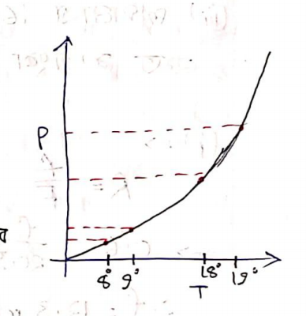(\*) এখানে কেন দুইবার পৃথকভাবে $\mathbf{1}^{\mathbf{\circ}}\mathbf{C}$ এ বাষ্পচাপ বৃদ্ধি হিসাব করা হলো?

$\Rightarrow$ কারণ তাপমাত্রার সাথে চাপের পরিবর্তন সরলরৈখিক নয়। ফলে যে তাপমাত্রার চাপ বের করতে বলবে তার সবচেয়ে কাছাকাছি যে দুটি তাপমাত্রার চাপ দেয়া থাকবে তাদের মধ্যকার ব্যবধান (ছোট পাল্লার জন্য) সরলরৈখিক ধরে ঐকিক নিয়মে ঐ তাপমাত্রার চাপ বের করতে হবে।

গ্রাফ হতে দেখা যায় ($8^{\circ}C - 9^{\circ}C$) এখানে $1^{\circ}C$ ব্যবধানে চাপের পার্থক্যের তুলনায় ($18^{\circ}C - 19^{\circ}C$) তে $1^{\circ}C$ ব্যবধানে চাপের পার্থক্য অনেক বেশি।

##### Q: কোনো একদিন বায়ুর তাপমাত্রা নিম্নলিখিত সারণী অনুযায়ী ২৩°C এবং শিশিরাঙ্ক ১৮°C। আপেক্ষিক আর্দ্রতা 60% হলে

| তাপমাত্রা ($^{\circ}$C) | সম্পৃক্ত বাষ্পচাপ (mm Hg) |
| :---------------------- | :------------------------ |
| 23                      | 20.5                      |
| 16                      | 10.5                      |

\(i\) শিশিরাঙ্কে (১৮°C) সম্পৃক্ত জলীয় বাষ্পের চাপ কত?

\(ii\) বায়ুতে বিদ্যমান জলীয় বাষ্পের চাপ কত?

\(iii\) তাপমাত্রা $16^{\circ}C$ এ নেমে আসলে বায়ুস্থ জলীয় বাষ্পের কত শতাংশ ঘনীভূত হবে?

### সমাধান

$(i) \Rightarrow$ দেওয়া আছে, বায়ুর তাপমাত্রা ২৩°C এ সম্পৃক্ত বাষ্পচাপ $F = 20.5\ mmHg$। আপেক্ষিক আর্দ্রতা $R = 60\% = 0.6$। শিশিরাঙ্কে সম্পৃক্ত বাষ্পচাপ $f$ (এটিই ১৮°C তাপমাত্রায় সম্পৃক্ত বাষ্পচাপ)।

আমরা জানি, $R = \frac{f}{F}$

$\Rightarrow 0.6 = \frac{f}{20.5}$

$\Rightarrow f = 0.6 \times 20.5\ mmHg$

$$\Rightarrow f = 12.3\ mmHg$$

সুতরাং, শিশিরাঙ্কে (১৮°C) সম্পৃক্ত জলীয় বাষ্পের চাপ $12.3\ mmHg$।

$(ii) \Rightarrow$ বায়ুতে বিদ্যমান জলীয় বাষ্পের চাপ শিশিরাঙ্কে সম্পৃক্ত জলীয় বাষ্পচাপের সমান। কারণ বায়ুতে থাকা জলীয় বাষ্প দ্বারাই শিশিরাঙ্কে বায়ু সম্পৃক্ত হয়। বাষ্পচাপ যেহেতু বাষ্পের ভরের সমানুপাতিক, এবং শিশিরাঙ্কে পৌঁছানো পর্যন্ত বায়ুতে জলীয় বাষ্পের ভরের পরিবর্তন হয় না (যদি তাপমাত্রা শিশিরাঙ্কের নিচে না নামে), তাই চাপও একই থাকে। $\therefore$ বায়ুতে বিদ্যমান জলীয় বাষ্পের চাপ $= 12.3\ mmHg$।

$(iii) \Rightarrow$ বায়ুতে বিদ্যমান জলীয় বাষ্পের চাপ (শিশিরাঙ্কের চাপ) = $12.3\ mmHg$। যখন তাপমাত্রা $16^{\circ}C$ এ নেমে আসে, তখন $16^{\circ}C$ তাপমাত্রায় বায়ুর জলীয় বাষ্প ধারণ ক্ষমতা বা সম্পৃক্ত বাষ্পচাপ $F' = 10.5mmHg$ (সারণী থেকে)।

যেহেতু বিদ্যমান বাষ্পচাপ ($12.3\ mmHg$) $16^{\circ}C$ এ সম্পৃক্ত বাষ্পচাপের ($10.5\ mmHg$) চেয়ে বেশি, তাই জলীয় বাষ্প ঘনীভূত হবে। ঘনীভূত হওয়া বাষ্পের চাপ = (বিদ্যমান বাষ্পচাপ - $16^{\circ}C$ এ সম্পৃক্ত বাষ্পচাপ)

$$= (12.3 - 10.5)mmHg = 1.8mmHg$$

শতাংশ শিশির ঘনীভূত হবে = $\frac{ঘনীভূত\ হওয়া\ বাষ্পের\ চাপ}{প্রাথমিক\ বিদ্যমান\ বাষ্পের\ চাপ} \times 100\%$

$= \frac{1.8}{12.3} \times 100\%$

$$\approx 14.63\%$$

সুতরাং, বায়ুস্থ জলীয় বাষ্পের প্রায় $14.63\%$ ঘনীভূত হবে।

## হাইগ্রোমিটার

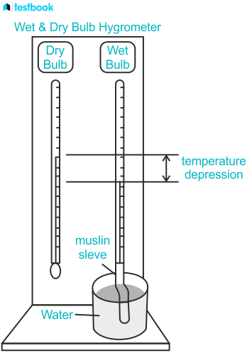

কোনো স্থানে কোনো সময়ের আর্দ্রতা পরিমাপের জন্য যে যন্ত্র ব্যবহৃত হয় তাকে হাইগ্রোমিটার বলে। এই যন্ত্রে একটি শুষ্ক ও একটি সিক্ত থার্মোমিটার থাকে।

সিক্ত থার্মোমিটারের বাল্বের সাথে পানিতে ডুবানো মসলিন বা লিনেনের কাপড় পরানো থাকে। কাপড় বেয়ে পানি উপরে ওঠার সময় বাষ্পায়িত হয়। পানি বাষ্পীভূত হওয়ার জন্য প্রয়োজনীয় সুপ্ততাপ পরিবেশ (সিক্ত বাল্বের চারপাশের বায়ু) থেকে গ্রহণ করে, ফলে সিক্ত বাল্ব শীতল হয় ও সিক্ত থার্মোমিটারের পাঠ ($\theta_{2}$) শুষ্ক থার্মোমিটারের পাঠ ($\theta_{1}$) অপেক্ষা কম হয়।

বায়ুর আপেক্ষিক আর্দ্রতা যত কম হবে, পানি তত বেশি বাষ্পায়িত হতে পারবে এবং সিক্ত থার্মোমিটারে তত কম পাঠ পাওয়া যাবে। ফলে আপেক্ষিক আর্দ্রতা যত কম হবে, শুষ্ক ও সিক্ত থার্মোমিটারের পাঠের ব্যবধান ($\theta_{1} - \theta_{2}$) তত বেশি হবে।

শুষ্ক থার্মোমিটারের পাঠ $\theta_{1}$, সিক্ত থার্মোমিটারের পাঠ $\theta_{2}$ ও শিশিরাঙ্ক $\theta$ হলে, গ্লেসিয়ারের সূত্রানুসারে: $\theta_{1} - \theta = G\left( \theta_{1} - \theta_{2} \right)$ এখানে, $G$ হলো গ্লেসিয়ারের ধ্রুবক, যার মান বায়ুর তাপমাত্রা (শুষ্ক বাল্বের পাঠ $\theta_{1}$) এবং বায়ুর চাপের উপর নির্ভর করে।

শিশিরাঙ্ক নির্ণয়ের জন্য উপরের সূত্রটিকে এভাবেও লেখা যায়: $\theta = \theta_{1} - G\left( \theta_{1} - \theta_{2} \right)$

**শুষ্ক ও সিক্ত থার্মোমিটারের পাঠের পার্থক্য দেখে আবহাওয়ার পূর্বাভাস:**

• পার্থক্য কম হলে: জলীয় বাষ্প বেশি, অর্থাৎ আবহাওয়া আর্দ্র।

• পার্থক্য বেশি হলে: জলীয় বাষ্প কম, অর্থাৎ আবহাওয়া শুষ্ক।

• পার্থক্য ধীরে ধীরে কমতে থাকলে: জলীয় বাষ্প ধীরে ধীরে বাড়ছে, অর্থাৎ বৃষ্টি হওয়ার সম্ভাবনা।

• পার্থক্য হঠাৎ কমলে: ঝড় হতে পারে।

• পার্থক্য শূন্য হলে ($\theta_{1} = \theta_{2}$): বায়ু জলীয়বাষ্প দ্বারা সম্পৃক্ত (আপেক্ষিক আর্দ্রতা ১০০%)

বায়ুতে যত বেশি জলীয় বাষ্প থাকবে বা বায়ু যত বেশি আর্দ্র হবে, আপেক্ষিক আর্দ্রতা তত বেশি হবে। এর ফলে শরীর থেকে ঘাম তত কম বাষ্পায়ীত হবে। তাই জলীয় বাষ্প বেশি হলে (অর্থাৎ উচ্চ আপেক্ষিক আর্দ্রতায়) অস্বস্তি লাগে।

##### Q: কোনো স্থানের বায়ুর তাপমাত্রা ও সিক্ত বাল্বের পাঠ এবং সংশ্লিষ্ট তথ্য নিচে দেওয়া হলো। আপেক্ষিক আর্দ্রতা নির্ণয় কর।

**সারণী ১: থার্মোমিটারের পাঠ**

| থার্মোমিটার                            | পাঠ           |
| :------------------------------------- | :------------ |
| শুষ্ক বাল্ব থার্মোমিটার ($\theta_{1}$) | $30^{\circ}C$ |
| সিক্ত বাল্ব থার্মোমিটার ($\theta_{2}$) | $28^{\circ}C$ |

**সারণী ২: বিভিন্ন তাপমাত্রায় সম্পৃক্ত বাষ্পচাপ (F)**

| তাপমাত্রা ($^{\circ}C$) | F (mm Hg) |
| :---------------------- | :-------- |
| 26                      | 25.25     |
| 28                      | 28.45     |
| 30                      | 31.85     |

**সারণী ৩: বিভিন্ন বায়ুর তাপমাত্রায় গ্লেসিয়ার ধ্রুবক (G)**

| বায়ুর তাপমাত্রা ($^{\circ}C$) | G    |
| :----------------------------- | :--- |
| 29                             | 1.66 |
| 31                             | 1.64 |

**সমাধান:**

দেওয়া আছে, শুষ্ক বাল্বের পাঠ $\theta_{1} = 30^{\circ}C$ ও সিক্ত বাল্বের পাঠ $\theta_{2} = 28^{\circ}C$

প্রথমে $30^{\circ}C$ বায়ুর তাপমাত্রায় $G$ এর মান নির্ণয় করতে হবে।

সারণী ৩ থেকে: $29^{\circ}C$ তাপমাত্রায় $G = 1.66$ ও $31^{\circ}C$ তাপমাত্রায় $G = 1.64$

$\left( 31^{\circ}C - 29^{\circ}C \right) = 2^{\circ}C$ তাপমাত্রা পার্থক্যে $G$ এর হ্রাস $= (1.66 - 1.64) = 0.02$

$\therefore 1^{\circ}C$ তাপমাত্রা বৃদ্ধিতে $G$ এর হ্রাস $= \frac{0.02}{2} = 0.01$

সুতরাং, $30^{\circ}C$ তাপমাত্রায় (যা $29^{\circ}C$ থেকে $1^{\circ}C$ বেশি), $G = 1.66 - 0.01 = 1.65$।

এখন শিশিরাঙ্ক $\theta$ নির্ণয় করি: $\theta = \theta_{1} - G\left( \theta_{1} - \theta_{2} \right)$

$\theta = 30 - 1.65(30 - 28)$

$\theta = 30 - 1.65 \times 2$

$\theta = 30 - 3.3$

$\theta = 26.7^{\circ}C$

এখন শিশিরাঙ্কে ($26.7^{\circ}C$) সম্পৃক্ত বাষ্পচাপ ($f$) নির্ণয় করতে হবে।

সারণী ২ থেকে: $26^{\circ}C$ তাপমাত্রায় সম্পৃক্ত বাষ্পচাপ = $25.25\ mmHg$ ও $28^{\circ}C$ তাপমাত্রায় সম্পৃক্ত বাষ্পচাপ = $28.45\ mmHg$

$\left( 28^{\circ}C - 26^{\circ}C \right) = 2^{\circ}C$ তাপমাত্রা পার্থক্যে বাষ্পচাপ বৃদ্ধি $= (28.45 - 25.25) = 3.2mmHg$।

$\therefore 1^{\circ}C$ তাপমাত্রা বৃদ্ধিতে বাষ্পচাপ বৃদ্ধি $= \frac{3.2}{2}\ mmHg = 1.6\ mmHg$

অতএব $26^{\circ}C$ থেকে $26.7^{\circ}C$ অর্থাৎ $(26.7 - 26) = 0.7^{\circ}C$ তাপমাত্রা বৃদ্ধিতে বাষ্পচাপ বৃদ্ধি $(\Delta f) = 1.6 \times 0.7mmHg = 1.12mmHg$।

সুতরাং, শিশিরাঙ্কে ($26.7^{\circ}C$) সম্পৃক্ত বাষ্পচাপ, $f = (25.25 + 1.12) = 26.37mmHg$।

বায়ুর তাপমাত্রায় ($30^{\circ}C$) সম্পৃক্ত বাষ্পচাপ, $F = 31.85\ mmHg$ (সারণী ২ থেকে)।

$\therefore$ আপেক্ষিক আর্দ্রতা, $R = \frac{f}{F} \times 100\%$

$R = \frac{26.37}{31.85} \times 100\%$

$$R \approx 82.79\%$$
